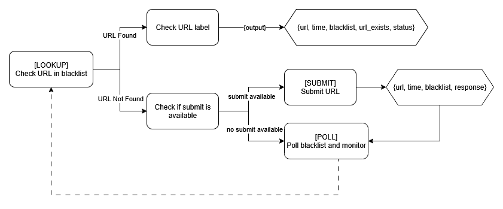

# Auto Blacklist Code

This repository requires:

JavaScript

- NodeJS
- npm

Python

- python-dotenv

After cloning, install required dependencies with

```
npm install
```

Remember to include your `.env` file in the root directory for the project to work.

## Blacklist Information

A list of all implemented (or unimplemented) blacklists is included in `blacklist_info.xlsx`

## Testing the Code

The code can be tested via

```
`node scripts/test.js`
```

This command runs the code on every URL listed in `url_list` (3 URLs provided) in every blacklist listed in `blacklist_list`.

A brief overview of the program flow can be found below


